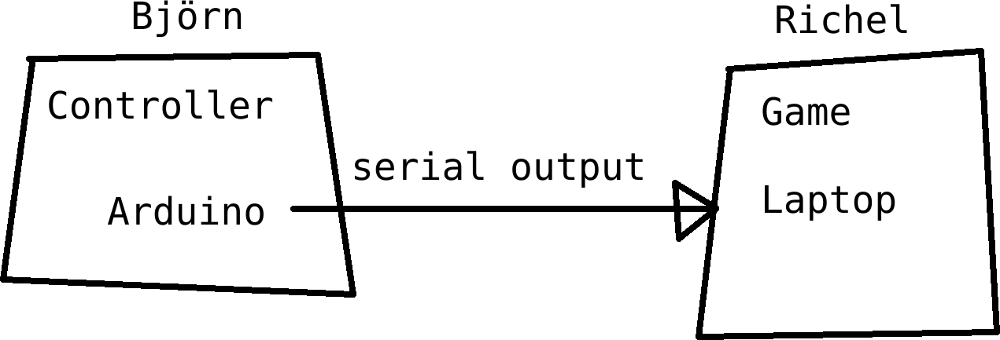

# bjoern_och_richels_tokiga_workshop

[This page is English, as Uppsala Makerspace has English members as well]

Björn och Richels tokiga workshop, or 'Björn and Richels wacky workshop'.

 * Goal: have fun and build something, using, among others, Arduino and Processing
 * When: Saturday February 4th 2023 13:00-20:00
 * Where: at Uppsala Makerspace
 * For whom: 
   * students from the Lördagskurser
   * members of Uppsala Makerspace

## Goal

To have fun and build something, using, among others, 
Arduino and Processing (a programming language).

The day will be lead by:
 * Björn: physical things team: Arduino, metal, wood, etc.
 * Richel: pure programming: Processing

Björn will start the day by announcing a wacky controller that his team will
be built. Possible wacky controllers are, for example, a 2 meter big joystick.
Björn then starts building the controller, which will have an Arduino in it.

Richels team will then start making a multiplayer game that uses that controller.
The game is chosen so that the wacky controller 
**outperforms** a regular controller.

Whatever it will be, *something* will be finished at the end.

## Timetable

When         |What
-------------|-----------------------------------------------------------
13:00-13:15  |Door open, participants are welcome
13:15-14:00  |First block
14:00-14:15  |Break
14:15-15:00  |Second block
15:00-15:15  |Break
15:15-16:00  |Third block
16:00-16:15  |Break
16:15-17:00  |Fourth block
17:00-18:00  |Pizza
18:00-18:45  |Fifth block
18:45-19:00  |Break
19:00-19:45  |Sixth block
19:45-20:00  |Play!

## Links

> QR code to this website
